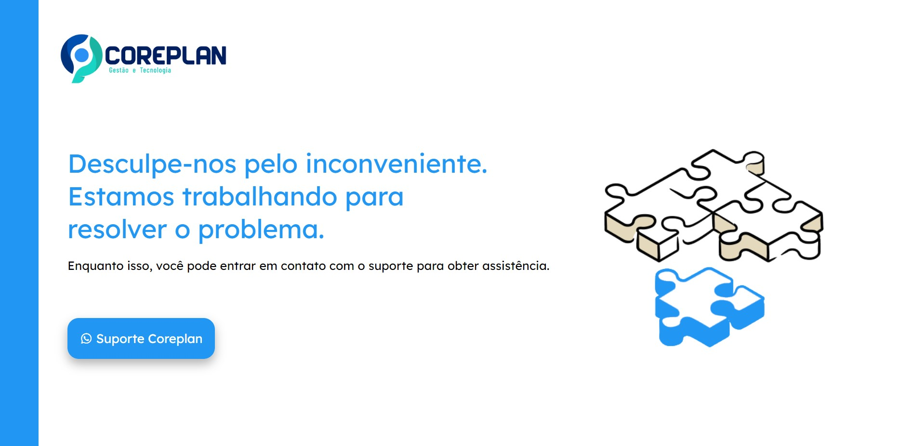

# PÁGINA DE ERRO

O projeto de criação de um layout de página de erro visa melhorar a experiência do usuário ao encontrar erros durante a navegação em um site ou aplicativo. O objetivo é fornecer uma página de erro mais compreensível e visualmente agradável.

O layout da página de erro também é responsivo, adaptando-se a diferentes dispositivos e tamanhos de tela, para garantir uma experiência consistente e acessível para os usuários em qualquer dispositivo.

[Clique aqui para acessar](https://campodonio.github.io/pagina-de-erro/)

## 🛠 Tecnologias 

- HTML
- CSS
- Git e GitHub